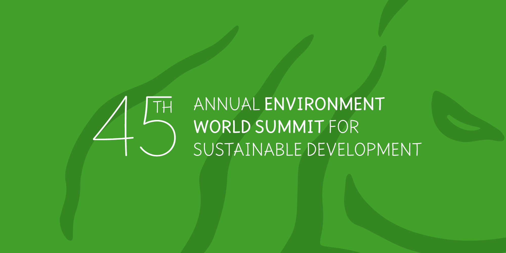
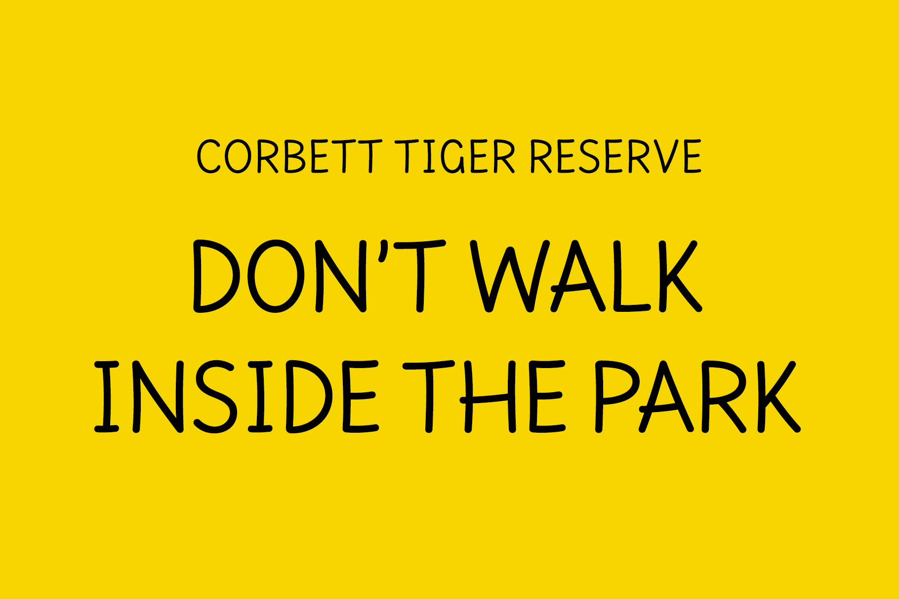

----

# Cause (Variable)

[![][Fontbakery]](https://googlefonts.github.io/googlefonts-project-template/fontbakery/fontbakery-report.html)
[![][Universal]](https://googlefonts.github.io/googlefonts-project-template/fontbakery/fontbakery-report.html)
[![][GF Profile]](https://googlefonts.github.io/googlefonts-project-template/fontbakery/fontbakery-report.html)
[![][Outline Correctness]](https://googlefonts.github.io/googlefonts-project-template/fontbakery/fontbakery-report.html)
[![][Shaping]](https://googlefonts.github.io/googlefonts-project-template/fontbakery/fontbakery-report.html)
[![][OpenType Specification]](https://googlefonts.github.io/googlefonts-project-template/fontbakery/fontbakery-report.html)
[![][Repository]](https://googlefonts.github.io/googlefonts-project-template/fontbakery/fontbakery-report.html)

[Fontbakery]: https://img.shields.io/endpoint?url=https%3A%2F%2Fraw.githubusercontent.com%2Fxconsau%2Fcause%2Fgh-pages%2Fbadges%2Foverall.json
[Universal]: https://img.shields.io/endpoint?url=https%3A%2F%2Fraw.githubusercontent.com%2Fxconsau%2Fcause%2Fgh-pages%2Fbadges%2FUniversalProfileChecks.json
[GF Profile]: https://img.shields.io/endpoint?url=https%3A%2F%2Fraw.githubusercontent.com%2Fxconsau%2Fcause%2Fgh-pages%2Fbadges%2FFontFileChecks.json
[Outline Correctness]: https://img.shields.io/endpoint?url=https%3A%2F%2Fraw.githubusercontent.com%2Fxconsau%2Fcause%2Fgh-pages%2Fbadges%2FOutlineChecks.json
[Shaping]: https://img.shields.io/endpoint?url=https%3A%2F%2Fraw.githubusercontent.com%2Fxconsau%2Fcause%2Fgh-pages%2Fbadges%2FShapingChecks.json
[OpenType Specification]: https://img.shields.io/endpoint?url=https%3A%2F%2Fraw.githubusercontent.com%2Fxconsau%2Fcause%2Fgh-pages%2Fbadges%2FOpenTypeSpecificationChecks.json
[Repository]: https://img.shields.io/endpoint?url=https%3A%2F%2Fraw.githubusercontent.com%2Fxconsau%2Fcause%2Fgh-pages%2Fbadges%2FRepositoryChecks.json

A semi-casual and optimistic sans-serif typeface, designed specifically for use in non-profit organizations, educational institutions, environmental campaigns and learning applications.

The font's design is mono-linear with rounded ends. The font is a result of the requirement where one needs a semi casual font (while not being too comic) – to be able to convey a serious message but in a friendly and comfortable way. Such a requirement is often seen in design works related to education, non-profit, food blogs, environmental campaigns and children collaterals, to list some.

## Building

Fonts are built automatically by GitHub Actions - take a look in the "Actions" tab for the latest build.

If you want to build fonts manually on your own computer:

* `make build` will produce font files.
* `make test` will run [FontBakery](https://github.com/googlefonts/fontbakery)'s quality assurance tests.
* `make proof` will generate HTML proof files.

The proof files and QA tests are also available automatically via GitHub Actions - look at `https://yourname.github.io/your-font-repository-name`.

## Changelog

**11 Apr 2024. Version 0.1**
- Initial release

## License

This Font Software is licensed under the SIL Open Font License, Version 1.1.
This license is available with a FAQ at
https://scripts.sil.org/OFL

## Repository Layout

This font repository structure is inspired by [Unified Font Repository v0.3](https://github.com/unified-font-repository/Unified-Font-Repository), modified for the Google Fonts workflow.
